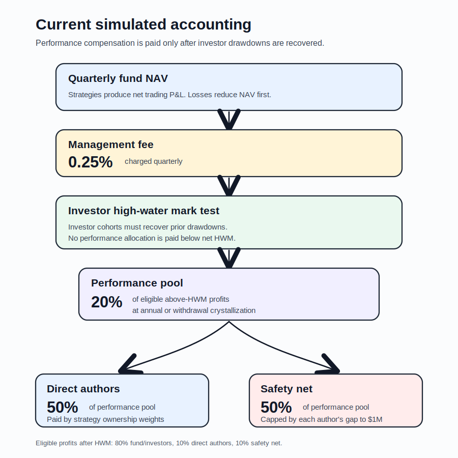
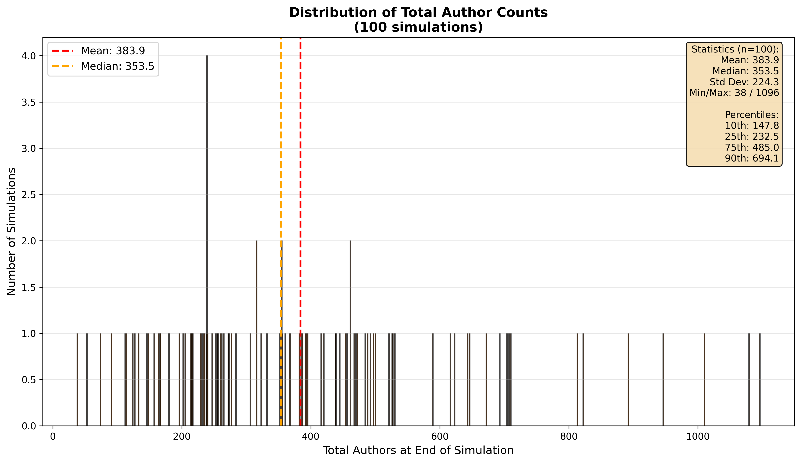

# Professor Quant Partnership Model

This repository studies a new research-lab funding model made possible by the rapid improvement of LLM coding.

University labs in mathematics, statistics, optimization, simulation, computational modeling, and related STEM fields already have the talent systematic hedge funds rely on. The old bottleneck was implementation: turning a research idea into clean data, backtests, diagnostics, risk controls, deployment code, and monitoring usually took more engineering time than a short sabbatical or research leave could support.

LLM-assisted coding changes that. A 6-12 month sabbatical or one-year leave can now be enough for professors to help invent or improve systematic trading strategies. If validated strategies are traded, part of the profits can fund the contributing labs over the following years.

In the current simulation, this loop can start with $20M of initial capital and grow into a $1B+ fund. The median 10-year investor outcome is about 3x capital, roughly 140-150 professors or labs participate, and five-year lab compensation is above $1M at the median.


## The One-Minute Version

- Professors contribute the core research hedge funds need: math, statistics, optimization, modeling, simulation, and rigorous empirical testing.
- LLM coding makes it realistic to turn those ideas into testable trading systems during a sabbatical or 6-12 month leave.
- The fund provides capital, data, execution infrastructure, monitoring, and continuity.
- Successful strategies generate profits above investor high-water marks.
- A share of those profits funds research labs through direct strategy-owner payouts and a safety-net pool.
- The simulation suggests this could become a large, repeatable alternative funding model for university labs, with successful contributors receiving more than $1M in cumulative support over the following years.

## Current Simulated Economics

The model is intentionally fund-accounting aware. It does not pay performance allocation merely because a strategy has a good quarter. Investors must first recover drawdowns through net high-water-mark accounting.



Current baseline assumptions:

- Initial fund AUM: `$20M`
- Management fee: `0.25%` per quarter
- Performance allocation: `20%` of eligible profits above investor high-water marks
- Crystallization: annually, with interim crystallization on withdrawals
- Direct strategy-owner payout: `50%` of the performance pool
- Safety-net payout: `50%` of the performance pool
- Safety-net threshold: `$1M` lifetime cumulative compensation per eligible contributor
- Active author hiring target: about one active research author per `$45M` of AUM
- New strategy birth capacity: `$10M-$50M`
- Absolute capacity per strategy: `$100M`

## Current Simulation Results

The current baseline batch run uses `100` paths, `40` quarters, and seed `42`.

| Metric | Median / Current Baseline Result |
| --- | ---: |
| Final fund AUM after 10 years | about `$1.27B` |
| Total authors after 10 years | `138.5` median |
| Five-year author compensation | `$1.34M` median |
| Five-year author compensation, p75 | `$1.63M` |
| Five-year author compensation, p90 | `$2.00M` |
| `$100` reference investment ending value | `$302.52` median |

These are simulation outputs, not forecasts. The purpose is to test whether the economic loop is internally coherent and whether the scale of the research-funding impact is large enough to justify deeper investigation.

## Simulation Charts

| Investor outcome | Author compensation |
| --- | --- |
|  |  |

| Final AUM | Total authors | Paid authors |
| --- | --- | --- |
|  |  |  |

## What The Model Simulates

The simulation is built from several interacting components:

- `strategy_lifecycle`: strategy invention, decay, capacity limits, and capacity improvements
- `author_collaboration`: professor research cycles, strategy invention, strategy improvement, and ownership assignment
- `capital_allocation`: capital deployment across available strategies
- `performance_allocation`: management fees, investor high-water marks, annual crystallization, withdrawal crystallization, author payouts, and safety-net payouts
- `investor_flow`: subscriptions, withdrawals, AUM growth limits, and capacity-aware inflow acceptance
- `external_shock`: crisis events and market stress

The model separates three important strategy concepts:

- deployed capital: how much capital is currently allocated to a strategy
- current strategy capacity: how much capital the strategy can currently accept
- absolute strategy capacity: a hard ceiling no single strategy can exceed

It also separates two author concepts:

- active sabbatical authors: currently available to invent or improve strategies
- safety-net authors: cumulative contributors who may still be eligible for compensation

## Run The Simulation

Set up the environment:

```bash
python3 -m venv venv
venv/bin/pip install -r requirements.txt
```

Run one detailed simulation:

```bash
venv/bin/python run_single_simulation.py --quarters 40 --seed 40
```

Run the current batch simulation:

```bash
venv/bin/python run_batch_simulation.py --runs 100 --quarters 40 --seed 42
```

Run tests:

```bash
venv/bin/python -m unittest discover -s tests
```

## Repository Map

```text
.
|-- README.md
|-- UNIVERSITY_PARTNERSHIP_PROPOSAL.md
|-- run_single_simulation.py
|-- run_batch_simulation.py
|-- components/
|   |-- author_collaboration/
|   |-- capital_allocation/
|   |-- external_shock/
|   |-- investor_flow/
|   |-- performance_allocation/
|   `-- strategy_lifecycle/
|-- tests/
|-- assets/
`-- batch_plot*.png
```

## Important Caveat

This is an economic simulation and proposal model. It is not investment advice or a live trading system. The goal is to make the assumptions explicit, test the accounting logic, and estimate whether a professor-led quant research partnership could plausibly become a meaningful alternative funding source for university labs.
