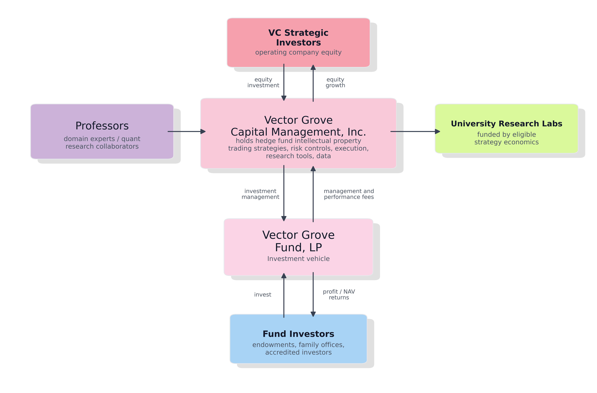

# University Partnership Structure Memo

## Why This Is Possible Now

We are at a unique point in history because agentic coding has recently become strong enough to change who can build and operate quantitative trading systems. As recently as the beginning of 2026, it became realistic for a strong researcher to use LLM coding agents to move from hypothesis to data cleaning, backtesting, diagnostics, execution logic, monitoring, and production-quality iteration in months rather than years.

The central idea is a hedge fund that can now partner with university professors and let them work, for a focused six-month period, as full-time quantitative researchers inside the fund. The fund provides the existing live strategies, trading capital, data, backtesting environment, execution system, risk controls, and operational continuity. The professor provides deep research judgment, mathematical insight, market curiosity, or modeling expertise.

If the professor's work improves an existing strategy or creates a validated new one, the economic value can be treated similarly to the performance allocation that a quantitative researcher would normally receive inside a hedge fund. Instead of that value being paid only as personal compensation, the structure can route an agreed share back to the professor's research lab or university-approved research account as alternative research funding.

This memo complements the simulation overview PDF in this repository. The simulation tests whether the funding loop can be internally coherent. This memo explains how that loop could be organized as a practical hedge-fund/university partnership.

## 1. What The Partnership Is And Is Not

The core structure is a research-and-trading capital partnership. On the capital side, a university endowment fund can invest as a limited partner in an already operating hedge fund. That gives the university a direct share of the economic upside from algorithmic quantitative strategies that have been tested in real financial markets. Separately, faculty may participate in structured research cycles aimed at improving existing systematic strategies or developing new ones.

The capital side and the faculty collaboration side are separable:

- Capital participation: the university endowment fund reviews the hedge fund and decides whether to invest as a limited partner.
- Faculty collaboration: professors can join defined research cycles to improve existing strategies or develop new ones, with participation handled under university policy.
- Lab funding channel: if approved strategies generate eligible profits, a defined share can fund the contributing professors' research labs.

The important practical distinction is that the fund does not depend on waiting for a new faculty-created strategy before capital can be put to work. The fund already has existing trading infrastructure and live strategy capability. Faculty collaboration is an additional research and strategy-development layer on top of that operating base.

## 2. Parties And Roles

The model involves several different institutional roles that should not be collapsed into one decision.

### University Endowment Fund

The capital allocator decides whether any capital participation is appropriate. This decision belongs to the university's investment process, not to an individual faculty member or academic department.

### Faculty And Research Labs

Faculty contributors participate in defined research cycles. They may improve existing strategies, propose new signals, improve execution logic, expand capacity, strengthen risk controls, or help build new strategy categories.

### Investment Manager / Platform Operator (Vector Grove Capital Management, Inc.)

The investment manager provides the operating environment:

- existing live strategies;
- research repository and tooling;
- data access;
- backtesting framework;
- slippage and execution modeling;
- broker and data vendor integrations;
- risk controls;
- deployment review;
- live monitoring;
- capital allocation across strategies;
- operational continuity after a faculty research cycle ends.

Vector Grove Capital Management, Inc. operates the research and trading platform. Vector Grove Fund, LP is the investment vehicle that trades validated strategies. Professors collaborate with the investment manager to improve or create strategies, and eligible strategy economics can support the contributing university research labs.

## 3. Faculty Collaboration Flow

A typical faculty collaboration cycle could run for six to twelve months.

### Stage 1: Research Intake

The professor identifies a research direction. The direction can be narrow or broad:

- improve an existing signal;
- reduce slippage;
- improve risk controls;
- expand strategy capacity;
- introduce a new asset, expiry, or regime filter;
- test a new modeling or optimization method;
- propose a new systematic strategy.

The professor does not need to arrive with a finished trading strategy. The starting point can be research judgment, mathematical insight, market curiosity, or a modeling hypothesis.

### Stage 2: Backtest And Evidence Package

The work must produce an evidence package before live deployment:

- data sources used;
- assumptions and filters;
- backtest results;
- robustness checks;
- transaction cost and slippage assumptions;
- capacity estimate;
- drawdown behavior;
- regime sensitivity;
- failure modes;
- monitoring requirements.

### Stage 3: Review Gate

The strategy or improvement is reviewed before capital allocation. Review should include:

- research validity;
- overfitting risk;
- data integrity;
- execution feasibility;
- slippage and liquidity;
- operational complexity;
- risk limits;
- correlation with existing strategies;
- expected capacity;
- live monitoring plan.

### Stage 4: Limited Deployment

If accepted, the strategy begins with limited capital or paper/live-shadow monitoring. The deployment is expanded only if live behavior remains consistent with the evidence package.

### Stage 5: Ongoing Maintenance

After the professor returns to normal university work, the fund manager maintains the strategy:

- data provider changes;
- broker API changes;
- execution logic updates;
- monitoring;
- risk controls;
- production incidents;
- capital allocation changes;
- retirement if the strategy decays.

This is a key reason the model is different from a professor independently using a generic fintech platform.

## 4. Attribution Policy

Attribution is one of the central design problems. A credible policy should be explicit before the pilot begins.

The platform should maintain a strategy ownership ledger. The ledger records:

- strategy identifier;
- original contributors;
- contribution type;
- date of contribution;
- accepted changes;
- ownership shares;
- performance period;
- capacity contribution;
- reason for later ownership changes.

Contribution types can include:

- original strategy invention;
- signal improvement;
- risk-control improvement;
- execution improvement;
- slippage reduction;
- capacity expansion;
- regime filter improvement;
- monitoring improvement;
- data cleaning or feature engineering improvement.

Ownership should not be based only on who first proposed an idea. A later contributor who materially improves capacity, robustness, or live tradability can create real economic value. The ledger should therefore allow ownership to update after validated improvements.

A practical default policy is:

- New accepted strategy: ownership starts equally among accepted inventors.
- Accepted material improvement: the improvement team is added to the ownership group.
- Future economics: ownership shares are updated prospectively, not retroactively.
- Minor maintenance: ordinary production maintenance by the platform does not automatically create strategy ownership.
- Dispute review: disputes are reviewed quarterly by a defined review committee.

## 5. Distribution Policy

The distribution policy should separate three concepts:

- fund-level investor returns;
- performance-based professor/lab payouts;
- safety-net professor/lab payouts.

The simulation currently uses the following illustrative structure:

- operating fee: 0.25% per quarter;
- professor/lab payout pool: 20% of eligible profits;
- performance share: 50% of the professor/lab payout pool;
- safety-net share: 50% of the professor/lab payout pool;
- safety-net threshold: up to $1 million cumulative support per eligible professor/lab.

Eligible profits are calculated only after prior investor losses are recovered. This is intended to keep the structure aligned with capital providers.

The performance share is distributed based on recorded strategy ownership and contribution. The safety-net share provides baseline research support to eligible contributors whose cumulative payouts remain below the threshold.

Any payment routing must be compatible with university policy.

The correct routing is a legal and policy question for each university.

## 6. Pilot Design

A pilot should test the actual economic loop in the simulation.

The starting configuration is:

- $20 million of initial fund capital.
- 2 initial professor contributors.
- 1 existing seed strategy that can accept capital immediately.
- A 2- to 4-quarter research window for each professor.
- Strategy-improvement work that can affect returns or capacity within 1 quarter.
- New-strategy invention work that takes 2 quarters.
- Annual profit allocation after investor losses are recovered.

Each quarter, the pilot tracks:

- fund AUM;
- active strategy count;
- deployed capital;
- unused strategy capacity;
- strategy returns;
- new strategies created;
- return improvements;
- capacity improvements;
- professor/lab payout pool;
- number of professors receiving funding.

The pilot is successful only if the loop works in practice: professors create or improve strategies, the fund can deploy capital into those strategies, and eligible strategy profits produce measurable research-lab funding.

## 7. Common Questions This Framework Answers

### What is the capital participation structure?

The capital side is an investment as a limited partner in an already operating hedge fund. The fund already has live trading infrastructure, existing strategies, data access, execution systems, monitoring, and risk controls. Capital can therefore be put to work in current algorithmic quantitative strategies while professor collaboration adds a second layer of research and strategy development.

### Does the professor need to arrive with a finished trading idea?

No. The professor does not need to bring a complete strategy on day one. The starting point can be research judgment, mathematical insight, modeling skill, or curiosity about markets. The work can improve an existing strategy, expand capacity, reduce slippage, strengthen risk controls, test new signals, or create a new strategy.

### Is this only for finance professors?

No. The useful skill set is broader than finance. Systematic trading depends on statistics, optimization, machine learning, operations research, physics, engineering, computational modeling, and careful empirical testing. A professor does not need to come from a finance department to contribute useful quantitative insight.

### Why is this possible now?

Agentic coding has reduced the implementation barrier. A strong researcher can now move from hypothesis to data cleaning, backtesting, diagnostics, execution logic, monitoring, and production iteration much faster than before. That makes a focused six-month research cycle meaningful in a way that was much harder before 2026.

### Why not just use a generic fintech platform?

The edge is not only in having software tools. It is in strategy-specific data, slippage modeling, execution logic, risk controls, monitoring, and capital allocation. Generic platforms may help with pieces of the workflow, but live trading requires customized systems that survive real market conditions. The fund provides that operating environment and keeps strategies running after the professor returns to the university.

### How does the university benefit?

The university can benefit in two ways. First, the endowment fund can participate as a limited partner and share in fund-level returns. Second, when professor-contributed strategies generate eligible profits, part of those economics can fund the contributing research labs. The same structure can therefore support the university through both investment performance and research funding.
